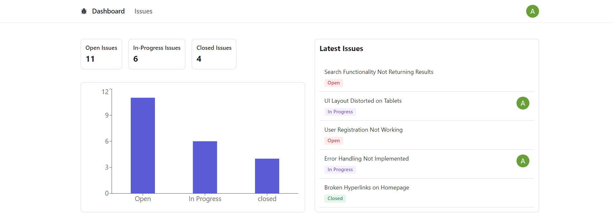
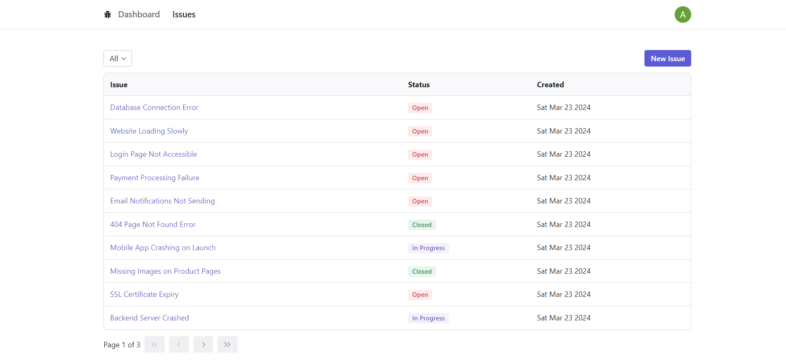
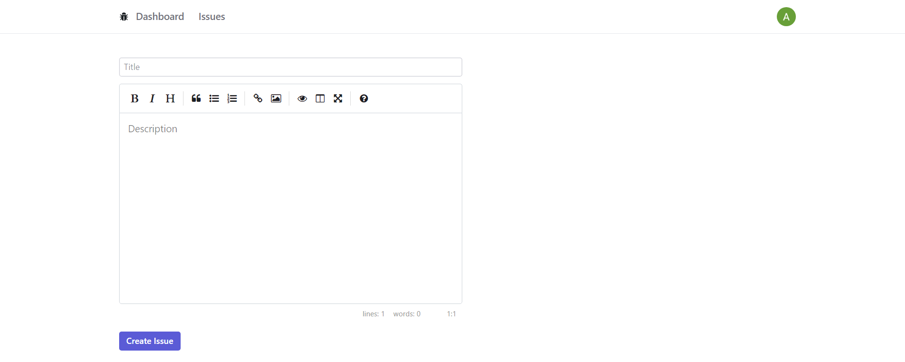
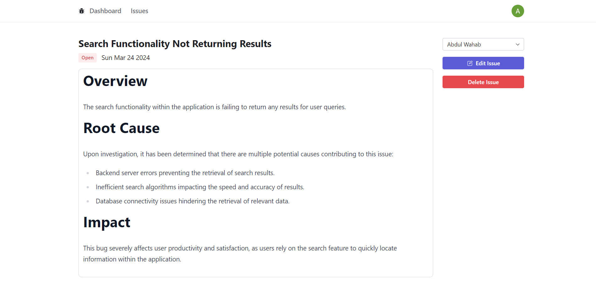

# Bug Bounty

Bug Bounty is a full-stack web application developed using Next.js, Prisma, and Next-Auth. The project enables users to manage issues within a project, including creating, editing, assigning issues to users, and deleting issues.

## Table of Contents

-   [Screenshots](#screenshots)
-   [Technologies Used](#technologies-used)
-   [What I Learned](#what-i-learned)
-   [Project Description](#project-description)
-   [Getting Started](#getting-started)
-   [Author](#author)

## Screenshots

## Technologies Used

- Next.js
- Prisma
- Next-Auth
- React Icons
- Radix UI Icons
- Tailwind CSS
- classnames
- Zod
- Radix
- React SimpleMDE
- React Markdown
- React Hook Form
- Axios
- React Loading Skeleton
- TanStack Query
- React Hot Toast

## What I Learned

Through developing Bug Bounty, I gained valuable experience in several key areas:

- Building full-stack applications with Next.js.
- Developing RESTful APIs and integrating them with Next.js.
- Utilizing Prisma for database management and integration with Next.js.
- Implementing OAuth authentication with Google using Next-Auth.

## Project Description

Bug Bounty provides users with a comprehensive platform for managing project issues. Users can perform various actions such as creating new issues, editing existing ones, assigning issues to specific users, and deleting issues. The application offers a seamless user experience with features like markdown editing, form validation, loading skeletons, and toast notifications.

## Getting Started

To run this project locally, follow these steps:

1. Clone this repository.
2. Install dependencies using `npm install`.
3. Create .env file to configure your environment variables for authentication and database connections. Copy the variables defined in .env.example.
4. Run the development server using `npm run dev`.

## Author

-   Abdul Wahab - [@abdulwahabse](https://github.com/abdulwahabse)
